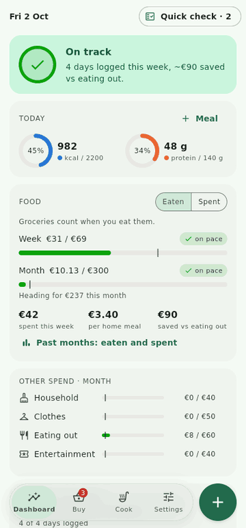
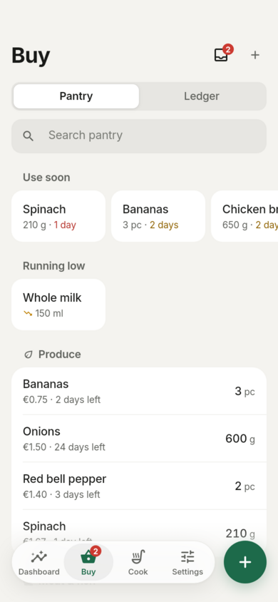
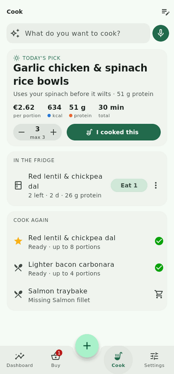
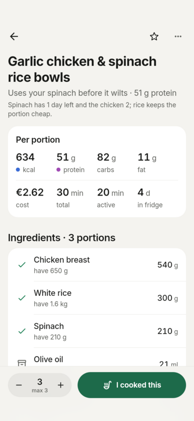
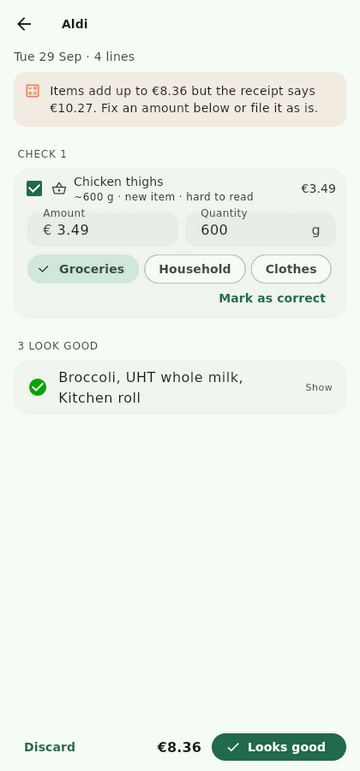
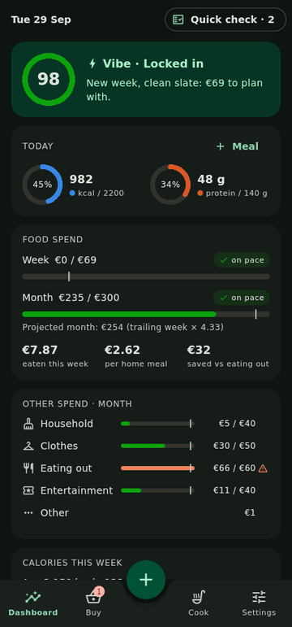

# Trackcalfin

A personal **micro-procurement, pantry and meal-prep tracker** built with Flutter, Dart and a local Isar database. Gemini 3.8 Flash does exactly three jobs: reading receipts, planning a daily recipe from your stock, and answering "can I cook this?". Everything else is deterministic Dart that works offline.

<table>
  <tr>
    <td></td>
    <td></td>
    <td></td>
  </tr>
  <tr>
    <td></td>
    <td></td>
    <td></td>
  </tr>
</table>

*Screenshots are from the Linux desktop build with demo data (`--dart-define=DEMO=true`).*

## What it does

| Tab | What you do | What the app does |
|---|---|---|
| **Dashboard** | Glance | Vibe Check score with one next-step insight, today's kcal/protein rings, weekly and monthly food spend with pace markers and a ×4.33 projection, other-spend limits, the week's calories, and a streak with a weekly freeze. All pure Dart. |
| **Buy** | Snap a receipt or pantry photo, or log an expense in 3 taps | Gemini extracts lines, categories, quantities and new-ingredient nutrition. Clean receipts file themselves; messy ones wait in the Inbox for one "Looks good". Receipts in another currency are converted at the European Central Bank rate for the purchase day, or from the amount your card was charged. The stock list shows use-soon and running-low items. |
| **Cook** | Tap "I cooked this ×3", tap "Eat 1", or ask "carbonara for two" | Daily pick from your stock (planned the evening before), exact stock deduction, fridge portions, macros logged when you eat, and a Dart-checked feasibility verdict for requests. |
| **⊕** | One button for every log | Scan, pantry photo, expense, cooked, ate. |

Principles: every log takes ≤ 3 seconds, the LLM proposes and Dart does the math, the app works offline, cooking and eating are separate events, and undo replaces confirmation dialogs. Details are in [docs/01](docs/01-behavioral-plan.md).

## Status

**Built and verified in this repo**
- All 33 sprints from the [sprint plan](docs/06-sprint-plan.md) are implemented.
- 111 automated tests pass: domain math, use cases against a real Isar database, the full AI pipeline against a scripted fake Gemini endpoint (including repair retries and allergen rejection), and widget smoke tests that drive the whole app. `flutter analyze` is clean.
- The Linux desktop build runs. The screenshots above come from it.

**Not verified here (needs your machine)**
- **Android and iOS builds.** The build environment couldn't download the Android SDK and has no Xcode. The native configuration (manifest permissions, notification receivers, desugaring, share intent, `Info.plist` usage strings, background task ID, `AppDelegate`) follows each plugin's README, but it hasn't been compiled.
- **Live Gemini calls.** No API key was available. Requests follow the documented `generateContent` shape. If the API rejects a config field (schema, thinking level, media resolution), the client automatically retries with a simpler body and remembers what works.

## Getting started

1. Install **Flutter 3.47.x (stable)**.
2. `flutter pub get`
3. Run it on your phone:
   - **Android:** plug in with USB debugging and run `flutter run --release`, or `flutter build apk --release` and sideload the APK.
   - **iOS:** open `ios/Runner.xcworkspace` in Xcode, pick your team under *Signing & Capabilities*, then `flutter run --release`.
4. Get a Gemini API key from [Google AI Studio](https://aistudio.google.com/) and paste it during onboarding or in **Settings → AI**. Tap **Test connection**. The key lives in the Android Keystore or iOS Keychain, never in the database or backups.
5. Optional sample data: `flutter run --dart-define=DEMO=true`. It only seeds an empty database.

On first launch, onboarding asks for your goals and staples, optionally takes 3 pantry photos, and requests notification permission.

**First time on a real phone?** Work through [docs/MANUAL_TESTING.md](docs/MANUAL_TESTING.md). It lists what the automated tests can't cover (camera, live Gemini, notifications, share sheet, voice) and has a report template for the next session.

## Develop

```bash
flutter analyze
flutter test                      # 111 tests; Isar's native core is loaded from the Linux plugin in your pub cache
dart run build_runner build       # after changing anything in lib/data/isar/collections/
flutter run -d linux --dart-define=DEMO=true   # quick UI iteration (needs libgtk-3-dev, libsecret-1-dev)
```

- `build_runner` is pinned to 2.15.1 because `isar_community_generator` 3.3.2 needs `analyzer < 11`.
- To change a prompt, add a new version (`assets/prompts/*.v2.md`), update the constant in `lib/data/ai/prompt_repository.dart`, and run `flutter test`. The tests parse each prompt's example output with the app's DTOs, so contract drift fails the build.

## Project layout

```
lib/
  app/            bootstrap, router, shell (⊕), providers, integrations (quick actions, share, lifecycle)
  core/           enums, Money, DayClock (rollover hour)
  domain/         pure-Dart engines: costing, nutrition, feasibility, depletion, dashboard, vibe, streak,
                  quick check, matcher, parsers, validation/ (receipt, recipe, allergen screen)
  data/isar/      collections (+ generated .g.dart)
  data/ai/        Gemini client, AI runner (repair retry + AiCallLog), DTOs, JSON schemas, context builders
  application/    use cases: ledger, pantry, cook, recipes, scan, daily pick, ask, habit scheduler, backup
  platform/       notifications, background task, speech, photo capture, image and secret stores
  features/       dashboard, buy, cook, capture, settings, onboarding
assets/prompts/   the three master system prompts (runtime assets)
test/             domain, application (Isar), data (AI layer), widget
```

## Architecture docs

| # | Document | What's inside |
|---|---|---|
| 01 | [Behavioral Optimization Plan](docs/01-behavioral-plan.md) | Fogg B=MAP per behavior, 3-second flows, friction rules, retention loop, notification budget, wireframes, onboarding |
| 02 | [Infrastructure & Data Flow](docs/02-infrastructure-and-data-flow.md) | Stack, layers, **every Gemini call** vs pure Dart, sequence diagrams, background jobs, resilience, security |
| 03 | [Algorithmic Engines](docs/03-algorithms.md) | Exact formulas: WAC costing, expiry, nutrition, feasibility, depletion, dashboard (×4.33), Vibe Check, parsers, matcher |
| 04 | [Database Schema](docs/04-database-schema.md) | Isar collections, indexes, invariants |
| 05 | [AI Layer & Prompts](docs/05-ai-layer-and-prompts.md) | Call config, request anatomy, input envelopes, validation pipeline, evaluation |
| 06 | [Sprint Plan](docs/06-sprint-plan.md) | The 33 sprints this build followed |

## Master system prompts

| Prompt | File |
|---|---|
| A · Receipt & expense extraction (image → JSON) | [`assets/prompts/receipt_extraction.v2.md`](assets/prompts/receipt_extraction.v2.md) |
| B · Daily stock-based recipe (inventory → recipe JSON) | [`assets/prompts/daily_recipe.v1.md`](assets/prompts/daily_recipe.v1.md) |
| C · Spontaneous recipe calculator (request + inventory → feasibility JSON) | [`assets/prompts/spontaneous_recipe.v1.md`](assets/prompts/spontaneous_recipe.v1.md) |

## Known limitations

- **iOS share sheet:** receiving shared screenshots needs a Share Extension target created in Xcode. The Android share sheet works out of the box.
- **Morning background task on iOS** is opportunistic (BGAppRefreshTask). The main path is "plan tonight, notify tomorrow": the next day's pick is generated in the evening while the app is open, then a local notification is scheduled.
- **Eating out:** meals eaten away from home are logged by hand (**I ate → Something else**) with your own kcal and protein estimate.
