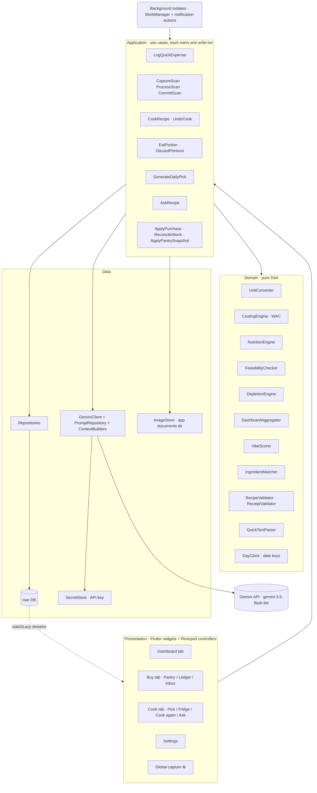
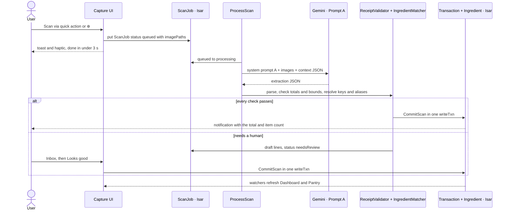
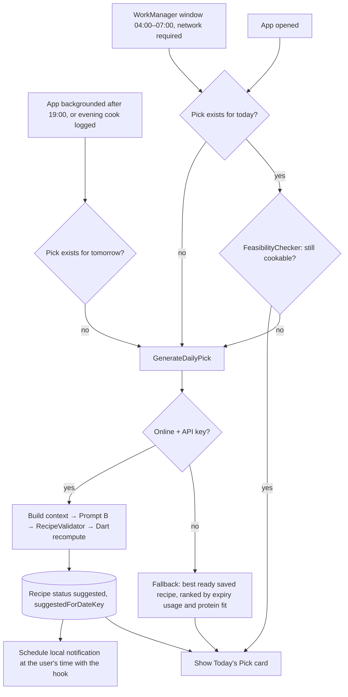
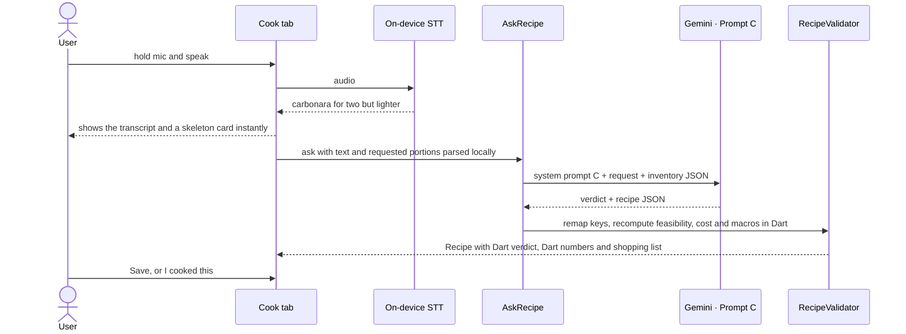
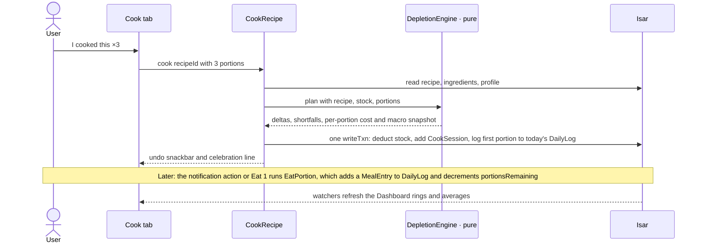

# 02 · Infrastructure & Data Flow

> **As built (differences from this plan).** The code in `lib/` is the source of truth. Where it differs from this document:
> - **HTTP client:** `package:http` instead of `dio`. It ships `MockClient`, which the AI tests use.
> - **No separate repository classes.** Each use case in `lib/application/` talks to Isar directly and owns its write transaction. Screens read reactive Isar queries through Riverpod providers (`lib/app/providers.dart`).
> - **Domain purity:** engines in `lib/domain/` never touch an `Isar` instance or do I/O, but they read the Isar entity classes as plain data rather than mapping to separate domain models.
> - **Navigation:** Settings is a fourth bottom-bar slot next to the ⊕ button (more discoverable than a gear icon), and the Cook tab's ask bar sits at the top of the screen so the ⊕ button never covers it.
> - **Extras:** a `MetricEvent` collection for time-to-log stats, a Light/Dark/System theme setting, a streak with a weekly freeze on the Dashboard, and opt-in demo data (`--dart-define=DEMO=true`).

## 2.1 Guiding rules

1. **LLM proposes, Dart disposes.** Gemini makes the *semantic* decisions: what's on this receipt, which dish to cook, which pantry item matches "parmesan". **All arithmetic is Dart**: costs, macros, depletion, totals, projections, scores. Model numbers are only a cross-check.
2. **Exactly three AI touchpoints** (Prompts A, B, C). Everything else, including the whole Dashboard, is deterministic and works offline.
3. **Isar is the single source of truth.** The UI reads reactive Isar queries and never holds business state of its own.
4. **One use case = one Isar write transaction.** No half-applied cooks or receipts.
5. **The domain layer is pure Dart** (no Flutter, Isar or HTTP imports), so all the math is unit-testable in milliseconds.

## 2.2 Stack

| Concern | Choice | Notes |
|---|---|---|
| UI / state | Flutter + `flutter_riverpod` | `StreamProvider`s wrap Isar watchers. `Notifier`s drive screen controllers. |
| Routing | `go_router` | `StatefulShellRoute` for the 3 tabs. Deep links from notifications (`/cook`, `/buy/inbox`). |
| Database | **`isar_community`** (+ `isar_community_flutter_libs`, `isar_community_generator`, `build_runner`) | Community-maintained fork of Isar 3.x with the same API. It exists to keep Isar 3 building on current Flutter and Android toolchains, so prefer it over the original `isar` package. |
| AI | Gemini **`gemini-3.5-flash-lite`** (fallback `gemini-3.8-flash`) via REST (`http`) | Thin in-house client. See §2.9 for why not an SDK. |
| Secrets | `flutter_secure_storage` | Gemini API key only. Never stored in Isar, exports or logs. |
| AI DTOs | `freezed` + `json_serializable` | Only for AI request and response payloads. Isar classes stay plain. |
| Camera | Document-scanner plugin (e.g. `cunning_document_scanner`), fallback `image_picker` | Auto edge detection and auto-capture, multi-page for long receipts. |
| Image prep | `flutter_image_compress` | Long edge ≤ 2400 px, JPEG quality ~85. |
| Voice | `speech_to_text` | On-device STT. We send **text** to Gemini, which is cheaper and faster than sending audio. |
| Background | `workmanager` | Fallback daily-pick generation. See §2.7. |
| Notifications | `flutter_local_notifications` | Scheduled, with action buttons handled in a background isolate. |
| Entry points | `quick_actions`, `receive_sharing_intent` | App-icon shortcuts, and the share sheet for e-receipts and screenshots. |
| Connectivity | `connectivity_plus` | Flushes the scan queue when the device comes back online. |

## 2.3 Layered architecture



## 2.4 Folder structure

```
lib/
  main.dart                      # bootstrap: open Isar, register background + notifications
  app/                           # router, theme, shell with ⊕ button
  core/                          # money.dart, units.dart, day_clock.dart, result.dart
  domain/                        # PURE DART: no flutter/isar/dio imports
    costing/  nutrition/  feasibility/  depletion/
    dashboard/  vibe/  matching/  validation/  parsing/
  data/
    isar/collections/            # @collection classes (see 04-database-schema.md)
    isar/isar_provider.dart
    repositories/                # IngredientRepo, LedgerRepo, RecipeRepo, LogRepo, ScanRepo, ProfileRepo
    ai/gemini_client.dart
    ai/prompt_repository.dart    # loads assets/prompts/*.vN.md
    ai/context_builders.dart     # Isar → input JSON for A/B/C
    ai/dto/                      # freezed DTOs for A/B/C outputs
    platform/                    # notifications, background, share intake, quick actions, image store
  application/                   # use cases (one file each)
  features/
    dashboard/  buy/  cook/  settings/  capture/   # widgets + controllers only
assets/prompts/                  # system prompts, versioned, loaded at runtime
test/
  domain/                        # mirrors lib/domain, bulk of the tests
  fixtures/ai/                   # sample AI outputs, including broken ones
```

## 2.5 The AI boundary: every Gemini call

| # | Trigger | Prompt | Input | Output → where | Thinking level | Offline / failure fallback | Expected frequency |
|---|---|---|---|---|---|---|---|
| A | User captures a receipt or pantry photo (⊕, quick action, share sheet, onboarding) | [`receipt_extraction.v3`](../assets/prompts/receipt_extraction.v3.md) | 1–3 images + locale + `known_ingredients` (key, name, unit) | Extraction JSON → `ScanJob.lines` (draft) → `Transaction` + `Ingredient` on commit | **low** (extraction that Dart verifies) | `ScanJob` stays `queued`. Retried on reconnect and app resume. | 2–5 per week |
| B | Evening before (primary), WorkManager morning window (fallback), app open with no pick (last resort), *Swap* button | [`daily_recipe.v2`](../assets/prompts/daily_recipe.v2.md) | Compact inventory (salt and oil included) + targets + profile + recent titles | Recipe JSON → `Recipe(origin: dailyAuto, suggestedForDateKey)` | **medium** | Best "ready" saved recipe, picked by `FeasibilityChecker` + expiry score | 1 per day + ≤ 2 swaps |
| C | User types or speaks a request on the Cook tab | [`spontaneous_recipe.v2`](../assets/prompts/spontaneous_recipe.v2.md) | Request text + parsed portions + inventory + profile | Feasibility + recipe JSON → `Recipe(origin: spontaneous)` | **medium** | Message "Needs a connection" + local title search over saved recipes | On demand, ~0–2 per day |
| F | A pantry photo was read (Prompt A), and some items have no price paid yet | [`price_lookup.v1`](../assets/prompts/price_lookup.v1.md) with **Google Search** | The products (exact name, unit, pack size) + country and currency | Shop price per pack, store, site → `DraftLine` price fields, asked about in review | **low** | Prompt A's estimates stand; review says why and offers **Try again** | With each pantry photo (off in Settings) |

### Never AI (pure Dart / Isar)

Dashboard (all cards), spend totals and the ×4.33 projection, Vibe Check, macro averages, weighted-average costing, recipe cost and macros, feasibility badges and max portions, depletion, undo, fridge portions, DailyLog totals, expiry estimates, quick-expense text parsing, ingredient alias matching, Quick Check candidate selection, weekly recap stats, "saved vs eating out", and the offline daily-pick fallback.

## 2.6 Data flows

### Flow 1: Receipt scan → ledger + pantry

`CommitScan` in one transaction: allocate basket-level adjustments proportionally → write `Transaction` (on the receipt's printed date) → create `Ingredient`s from `new_ingredient` profiles → `CostingEngine.applyPurchase` for each grocery line the user keeps in the pantry, or only `learnPrice` for a line that is already counted or used up → append normalized raw text to `Ingredient.aliases` → re-cost the recipes that use those items → mark `ScanJob.committed`.

Before that, the validator checks the receipt against what the app already knows ([03 §3.16](03-algorithms.md#316-scan-checks-the-receipts-date-pantry-questions-duplicates)): an old date keeps perishables that have spoiled since out of the pantry, a pantry count made after the purchase may already include an item, and a receipt matching one already filed is flagged. Each of these holds the scan for review instead of auto-committing.

Pantry-photo scans (`stock_mode: set`) take the same pipeline but commit through `ApplyPantrySnapshot`. The user sees a diff (current vs detected). For an item already on hand, the review asks "Same one or extra?": the same one means the detected quantity replaces `qtyOnHand`, extra means it is added. Either way `lastVerifiedAt` and `lastCountedAt` are set to the photo's time. The model also names the exact product and estimates its usual shop price. Prompt F then looks the price of each item without a price paid up on Google, and review asks "Is that the price?" for each one ([05 §5.10](05-ai-layer-and-prompts.md#510-exact-products-and-shop-prices-prompts-a-v3-and-f)). A confirmed price counts as real; an unanswered one is kept as an estimate. No `Transaction` is written.

### Flow 2: Daily pick ("plan tonight, notify tomorrow")

Background execution on mobile is unreliable (iOS `BGAppRefreshTask` is opportunistic, and Android Doze delays work), while **locally scheduled notifications are reliable**. So we generate the pick the **evening before**, while the app is in use, and schedule the morning notification with the real hook text.



### Flow 3: Spontaneous request

If the Dart-computed feasibility disagrees with the model's `status`, Dart wins and the disagreement is logged to `AiCallLog` for prompt tuning.

### Flow 4: Cook → fridge → eat → dashboard

**Why cooking and eating are separate events:** stock leaves the pantry when you *cook*, but calories enter your body when you *eat*. Logging all 5 meal-prep portions on Sunday would make Sunday a 4,000-kcal day and leave Monday to Thursday empty. `CookSession` is the fridge, and `DailyLog` records only what was eaten.

### Flow 5: Quick expense
`⊕ → Expense → amount → chip tap` runs `LogQuickExpense` → one `Transaction` with a single line (`source: manual`) → the dashboard watcher fires. Alternatively, text such as `"12.5 lunch"` goes through `QuickTextParser` (keyword → category, learned keyword memory) with no network.

### Flow 6: Reactive dashboard
```
isar.transactions.watchLazy() ─┐
isar.dailyLogs.watchLazy()     ├─ merge → debounce 150 ms → load window from repos
isar.userProfiles.watchLazy()  │     (month + trailing 28 d of transactions, this week + last week of DailyLogs)
dayRolloverTicker (4:00 AM, app resume) ┘
                → DashboardAggregator.compute(window, now) → VibeScorer.score(...)
                → DashboardState (immutable) → widgets
```
The aggregation handles a few hundred objects, which takes microseconds, so no caching layer is needed.

### Screen ↔ data map

| Screen | Reads (watch) | Writes via |
|---|---|---|
| Dashboard | Transactions (window), DailyLogs (2 weeks), UserProfile | — (read-only) |
| Buy · Pantry | Ingredients | `ReconcileStock`, ingredient edit, `ApplyPurchase` (manual purchase) |
| Buy · Ledger | Transactions | `LogQuickExpense`, edit, delete |
| Buy · Inbox | ScanJobs (`needsReview`, `failed`) | `CommitScan`, `ApplyPantrySnapshot`, discard |
| Cook · Today | Recipe (today), Ingredients | `GenerateDailyPick`, `CookRecipe` |
| Cook · Fridge | CookSessions (`active`) | `EatPortion`, `DiscardPortions` |
| Cook · Cook again | Recipes (favorite or cooked before) + Ingredients | `CookRecipe` |
| Cook · Ask | — | `AskRecipe` → Recipe (`suggested`) |
| Settings | UserProfile | profile update, API key → SecretStore |

## 2.7 Background work & notifications

| Job | Mechanism | Notes |
|---|---|---|
| Next-day pick (primary) | Foreground, on `AppLifecycleState.paused` after 19:00, or right after an evening `CookRecipe` | Runs while the app is alive, so it's reliable. Schedules the morning notification with the real `hook`. |
| Daily pick (fallback) | `workmanager` periodic task (~every 6 h, `NetworkType.connected`), acts only in the 04:00–07:00 window when no pick exists | The background isolate opens Isar with the same schemas and directory (`Isar.getInstance() ?? Isar.open(...)`). On iOS it's opportunistic and best-effort only. |
| Meal-time reminders | `flutter_local_notifications` zoned schedule, re-planned whenever fridge contents change | Only scheduled when there are active portions. |
| Notification actions ("Ate it") | `onDidReceiveBackgroundNotificationResponse` (top-level, `@pragma('vm:entry-point')`) | Opens Isar in the isolate and calls the same `EatPortion` use case. Isar watchers in the UI isolate pick up the change. |
| Scan queue flush | App resume + `connectivity_plus` online event | Up to 3 attempts, exponential backoff. |
| Housekeeping | App start, at most once a day | Delete receipt images older than 30 days, prune unsaved and uncooked suggested recipes older than 30 days, cap `AiCallLog` at 200 rows. |

## 2.8 AI call resilience

| Failure | Behavior |
|---|---|
| No network | Scan: stays queued. Pick: algorithmic fallback. Ask: "needs connection" + local search over saved recipes. |
| HTTP 429 / 5xx | Retry at 2 s and 8 s, then give up for now (scan → `queued` with `attempts++`, 3 attempts max → `failed`). |
| Timeout | A: 60 s, B/C: 45 s. Treated like a 5xx. |
| `finishReason` = MAX_TOKENS (truncated JSON) | Retry once with double `maxOutputTokens`. |
| JSON parse or schema error | **One repair retry**: send the previous output back plus the validator's error list, and ask for the corrected JSON only. If it still fails → `failed`, with the raw output kept in `AiCallLog`. |
| Semantic validation flags (unknown key, over-quantity, divergence) | Auto-fixed where safe (remap, clamp portions), otherwise surfaced as amber UI flags. See [05](05-ai-layer-and-prompts.md#55-validation-pipeline). |
| Allergen detected by the Dart screen | Output rejected, then a repair retry with an explicit error. It is never shown to the user. |
| `image_type: unreadable` | `ScanJob.failed` with a reason, and an Inbox card with a **Retake** button. |
| Price lookup (F) fails | The pantry photo still goes to review with Prompt A's estimates. `ScanJob.priceLookupError` says why, and **Try again** reruns the lookup. A 400 from a model without Google Search doesn't change the request config of other calls. |

## 2.9 Security, privacy, and the SDK choice

- **Personal-use deployment:** a direct REST call to the Gemini API using the user's own key from `flutter_secure_storage`. The key is typed once in onboarding and never compiled into the app binary.
- **Why REST instead of an SDK:** the old `google_generative_ai` Dart package is deprecated, and Google now points Flutter apps to Firebase AI Logic (`firebase_ai`). That's the right choice **if you ever distribute the app** (no key on the device, plus App Check). For a single-user build, a ~150-line `dio` client avoids a Firebase project, keeps full control of the request JSON (thinking level, schema, media resolution), and is trivial to swap later because every call goes through the `GeminiClient` interface.
- **Data leaving the device:** only the three AI payloads (receipt images, inventory summaries, the request text), plus two currency codes and a date to `api.frankfurter.dev` when a receipt is in another currency. Receipt images live in the app's documents directory and are auto-deleted after 30 days. Check whether your API tier allows Google to use prompts for product improvement (free tiers have historically allowed this), and use a paid-tier key if receipts are sensitive.
- **Prompt injection:** each prompt tells the model to treat image text and `user_request` as data. Dart validation blocks anything outside the contract regardless.

## 2.10 Backup

Local-only data dies with the phone. Settings → **Export** writes (a) a JSON dump of all collections except `AiCallLog` and (b) an `isar.copyToFile()` snapshot, then hands both to the system share sheet (Drive, Files, email). **Import** accepts the JSON dump. This is Sprint 33, but do it early if the app becomes your real ledger.
