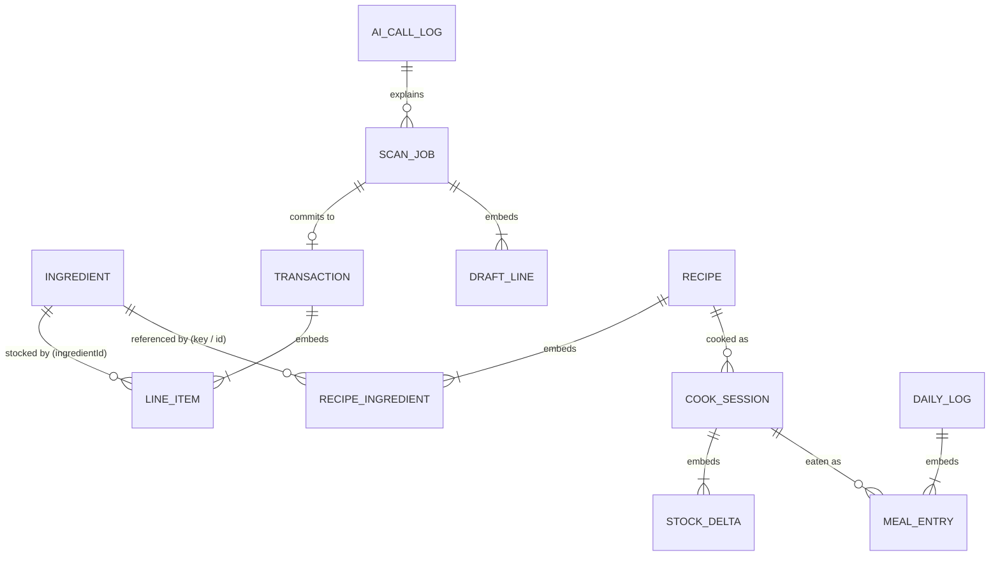

# 04 · Database Schema (Isar)

Target: **`isar_community` 3.x** (API-compatible with Isar 3). Import `package:isar_community/isar.dart`, generate with `isar_community_generator` + `build_runner`.

> **As built.** The Dart classes in `lib/data/isar/collections/` are the source of truth. They add a few fields to what's listed below: `Recipe.feasibilityStatus/summary/omitted/shoppingList` (Prompt C verdict), `ScanJob.userHint` and `ScanJob.fxRate/fxSource/fxDate`, `Transaction.originalCurrency/originalTotalMinor/fxRate`, and `UserProfile.onboardingDone/notificationsEnabled/weeklyRecapEnabled/autoCommitCleanScans/themeMode/fxMemory`. There's also a ninth collection, `MetricEvent`, for local time-to-log stats. `late` fields were replaced with defaults so an unset field never throws.
>
> **Schema 3: no staples.** Nothing is "always there" any more: salt, oil and spices are pantry items like everything else, counted, deducted when cooked and costed. `TrackingMode` and `IngredientRole.staple` are gone (the old column survives as `Ingredient.legacyTrackingMode` for the migration only). Schema 3 also adds what scanning needs to respect a receipt's date and to ask about duplicates: `Ingredient.lastCountedAt/costIsEstimate`, `ScanJob.duplicateOfTxId/duplicateOfJobId` and `DraftLine.product/packageQty/packagePriceMinor/stock/stockCheck`.

## 4.1 Design decisions

| Decision | Why |
|---|---|
| **Four core collections** (`Ingredient`, `Transaction`, `Recipe`, `DailyLog`) **plus four supporting ones** (`CookSession`, `ScanJob`, `UserProfile`, `AiCallLog`) | Each supporting collection models a real lifecycle the core four can't hold cleanly. `CookSession` is the fridge (meal-prep portions that span days). `ScanJob` is the async AI queue and review draft, which keeps the ledger free of half-finished data. `UserProfile` holds goals and settings. `AiCallLog` supports prompt debugging. |
| Money = `int` minor units, per-unit costs = `double` | No float drift in totals. Per-gram costs need fractions. |
| Quantities in the ingredient's **base unit** | All math is unit-free after `UnitConverter`. |
| Enums stored **by name** (`@Enumerated(EnumType.name)`) | Reordering enum values can never corrupt data. |
| **Snapshots** of cost and macros on `CookSession` and `MealEntry` | Prices change, and history must stay what it was when it happened. |
| `DailyLog` = **one document per day** with embedded meals and **recomputed** totals | The dashboard reads 7–14 small docs. The totals invariant is easy to enforce. |
| Embedded objects instead of links for line items, recipe ingredients and meals | They're always read with their parent, and cross-collection references are plain `int` ids (stable, cheap, isolate-safe). |
| `ingredientKey` (slug) as the stable cross-system ID | It's the same identifier the AI sees and returns. Ids stay internal. |

## 4.2 Entity relationships



## 4.3 Enums

```dart
// lib/core/enums.dart
enum BaseUnit { g, ml, pc }
enum IngredientCategory {
  produce, meatFish, dairyEggs, grainsPasta, legumesNuts, cannedJarred,
  bakery, frozen, spicesCondiments, oilsFats, beverages, snacksSweets, other,
}
enum SpendCategory { groceries, household, clothes, eatingOut, entertainment, other }
enum LineType { product, adjustment, deposit, fee }
enum DataSource { none, aiEstimate, user, label }   // none = macros unknown, the AI fills them in
enum Confidence { high, medium, low }
enum QtySource { printed, inferred, estimated, unknown }
enum TxSource { receiptScan, manual, quickText }
enum RecipeOrigin { dailyAuto, spontaneous, manual }
enum RecipeStatus { suggested, saved, dismissed, archived }
enum IngredientRole { stock, missing }               // nothing is assumed: no staples
enum CookStatus { active, finished, discarded, undone }
enum MealSource { cookedNow, fridge, quickAdd, pantry }   // pantry: eaten straight from stock (Say it)
enum ScanStatus { queued, processing, needsReview, committed, failed, discarded }
enum ScanKind { unknown, receipt, pantry, unreadable }
enum StockEffect { add, replace, none }             // what filing a scan line does to the pantry
enum StockCheck { onHand, counted, usedUp, whatsLeft } // why a scan line asks about it
enum UseKind { eaten, thrownAway }                  // what happened to food gone without a meal
enum PriceSource { estimate, web }                  // a pantry photo's shop price: the model's idea, or Google
enum FoodBasis { eaten, spent }                     // what the dashboard's food budget counts
enum AiTask { receipt, dailyRecipe, spontaneousRecipe, nutritionEstimate, nutritionLabel, priceLookup, quickLog }
```
AI JSON uses snake_case (`meat_fish`, `eating_out`). The DTO layer maps with an explicit `switch` and never uses `EnumType.name` on AI strings directly.

## 4.4 Shared embedded objects

```dart
@embedded
class Nutrition {
  double kcal = 0;
  double proteinG = 0;
  double carbsG = 0;
  double fatG = 0;
  double fiberG = 0;
}
```
Add `operator +` and `scale(double f)` as extension methods in `domain/nutrition/`, which keeps the Isar class a plain data holder.

## 4.5 Core collection · `Ingredient` (the stock tracker)

```dart
@collection
class Ingredient {
  Id id = Isar.autoIncrement;

  /// Stable slug shared with the AI ("chicken_breast"). Never renamed after creation.
  @Index(unique: true, replace: false)
  late String key;

  late String name;

  /// Normalized raw receipt strings confirmed for this ingredient ("HOCHL BRUSTFILET").
  @Index(type: IndexType.hashElements)
  List<String> aliases = [];

  @Enumerated(EnumType.name)
  IngredientCategory category = IngredientCategory.other;

  @Enumerated(EnumType.name)
  BaseUnit baseUnit = BaseUnit.g;

  /// "staple" for items assumed always available before schema 3; read only by Migrations.
  @Name('trackingMode')
  String? legacyTrackingMode;

  /// On-hand quantity in [baseUnit]. Invariant: >= 0.
  double qtyOnHand = 0;

  /// Weighted average cost, minor units per base unit (0.998 = 9.98/kg).
  double avgCostPerUnitMinor = 0;

  /// avgCostPerUnitMinor is an AI shelf-price estimate (pantry photo), not a price paid.
  bool costIsEstimate = false;

  double? gramsPerPiece;       // required when baseUnit == pc
  double? densityGPerMl;       // for ml items; null = 1.0

  /// Per 100 g (g and pc items) or per 100 ml (ml items).
  Nutrition per100 = Nutrition();

  @Enumerated(EnumType.name)
  DataSource nutritionSource = DataSource.none;

  /// When the user confirmed per100 (label scan, own numbers, "Confirm"); null = unconfirmed.
  DateTime? nutritionConfirmedAt;

  int shelfLifeDays = 7;

  /// Soonest estimated expiry of what is on hand (see ExpiryEstimator).
  @Index()
  DateTime? expiresAt;

  double lowStockThreshold = 0;
  DateTime? lastPurchasedAt;
  double lastPurchaseQty = 0;

  /// null = needs verification (shortfall detected or never checked).
  DateTime? lastVerifiedAt;

  /// Last count by looking (pantry photo, Quick Check, hand adjustment); purchases don't set it.
  DateTime? lastCountedAt;

  DateTime updatedAt = DateTime.now();
}
```

## 4.6 Core collection · `Transaction` (the ledger)

Only **committed money** lives here. Drafts live in `ScanJob`.

```dart
@collection
class Transaction {
  Id id = Isar.autoIncrement;

  @Index()
  late DateTime occurredAt;

  @Enumerated(EnumType.name)
  TxSource source = TxSource.manual;

  String? merchant;

  /// Grand total paid (== Σ lines.totalMinor after adjustment allocation).
  int totalMinor = 0;

  String currency = 'EUR';

  /// Largest category by amount, for list icons and filters.
  @Index()
  @Enumerated(EnumType.name)
  SpendCategory primaryCategory = SpendCategory.groceries;

  /// Every transaction has ≥ 1 line; dashboards sum lines, never totals.
  List<LineItem> lines = [];

  int? scanJobId;
  String? note;
  DateTime createdAt = DateTime.now();
}

@embedded
class LineItem {
  String rawText = '';
  String name = '';

  @Enumerated(EnumType.name)
  LineType lineType = LineType.product;

  @Enumerated(EnumType.name)
  SpendCategory category = SpendCategory.groceries;

  /// Net of discounts, including allocated basket adjustments.
  int totalMinor = 0;

  int? ingredientId;           // set when the line added to stock (delete takes qtyBase back out)
  String? ingredientKey;       // every grocery line that maps to a pantry item, stocked or not
  double? qtyBase;             // quantity added to stock, in the ingredient's base unit
  double? qtyBought;           // quantity on the line, stocked or not: store prices (PriceBook)
  @Enumerated(EnumType.name)
  BaseUnit? unit;              // qtyBought's unit; a price in a unit the item no longer uses isn't compared
  String? product;             // exact product from the receipt ("Barilla Spaghetti n.5, 500 g")
}
```
`qtyBought` is null on a Say it buy priced only at the usual price: an estimate is no store's price.
> The name `Transaction` gives you `isar.transactions`. If it ever collides with another package's symbol, rename the Dart class to `LedgerTransaction` and keep the stored collection name with `@Name('Transaction')`.

## 4.7 Core collection · `Recipe`

```dart
@collection
class Recipe {
  Id id = Isar.autoIncrement;

  late String title;
  String hook = '';            // ≤ 70 chars, notification + card subtitle
  String why = '';
  String cuisine = '';

  @Enumerated(EnumType.name)
  RecipeOrigin origin = RecipeOrigin.manual;

  @Index()
  @Enumerated(EnumType.name)
  RecipeStatus status = RecipeStatus.suggested;

  /// yyyymmdd the daily pick is for; null for non-daily recipes.
  @Index()
  int? suggestedForDateKey;

  String? sourceQuery;         // user's words (spontaneous)

  int defaultPortions = 1;
  int prepMinutes = 0;
  int cookMinutes = 0;
  int activeMinutes = 0;
  int fridgeLifeDays = 3;

  List<RecipeIngredient> ingredients = [];
  List<String> steps = [];
  List<String> tags = [];

  /// Dart-computed at generation; recomputed on cook (snapshot goes to CookSession).
  Nutrition perPortion = Nutrition();
  int costPerPortionMinor = 0;

  /// Model's own estimate, kept only for divergence monitoring.
  Nutrition? aiPerPortion;
  int? aiCostPerPortionMinor;

  List<String> validationFlags = [];

  @Index()
  bool favorite = false;

  int timesCooked = 0;
  DateTime? lastCookedAt;
  int lastPortionsCooked = 0;  // default for the portion stepper
  String? promptVersion;
  DateTime createdAt = DateTime.now();
}

@embedded
class RecipeIngredient {
  String key = '';             // ingredient key; '' for missing items
  String name = '';
  int? ingredientId;           // resolved by IngredientMatcher at save time
  double qtyPerPortion = 0;

  @Enumerated(EnumType.name)
  BaseUnit unit = BaseUnit.g;

  @Enumerated(EnumType.name)
  IngredientRole role = IngredientRole.stock;

  String? prepNote;
  String? substitutesFor;

  /// Only for role == missing (model estimates).
  int? estCostMinor;
  Nutrition? estNutritionPerPortion;
}
```

## 4.8 Core collection · `DailyLog` (intake per day)

```dart
@collection
class DailyLog {
  Id id = Isar.autoIncrement;

  /// yyyymmdd in local time with the rollover hour applied (DayClock.dateKey).
  /// Unique index → generated getByDateKey / putByDateKey.
  @Index(unique: true, replace: false)
  late int dateKey;

  List<MealEntry> meals = [];

  // Denormalized — ALWAYS recomputed from [meals] in the same write txn.
  Nutrition totals = Nutrition();
  int foodCostMinor = 0;
  int mealsCount = 0;

  DateTime updatedAt = DateTime.now();
}

@embedded
class MealEntry {
  String entryId = '';         // microsecondsSinceEpoch as string; for undo / delete
  DateTime eatenAt = DateTime.now();

  @Enumerated(EnumType.name)
  MealSource source = MealSource.fridge;

  int? cookSessionId;
  int? recipeId;
  String title = '';
  double portions = 1;

  Nutrition nutrition = Nutrition();   // snapshot for [portions]
  int costMinor = 0;                   // snapshot for [portions]

  String? ingredientKey;               // MealSource.pantry: the item eaten,
  double? qtyBase;                     // ... and what left stock (deleting the entry puts it back)
}
```

## 4.9 Supporting collection · `CookSession` (the fridge)

```dart
@collection
class CookSession {
  Id id = Isar.autoIncrement;

  @Index()
  late DateTime cookedAt;

  late int recipeId;
  String recipeTitle = '';

  int portionsCooked = 1;
  int portionsRemaining = 0;
  int portionsDiscarded = 0;

  /// Snapshots at cook time (WAC and nutrition at that moment).
  Nutrition perPortion = Nutrition();
  int costPerPortionMinor = 0;

  /// Exact deductions — makes undo lossless and exposes stock drift.
  List<StockDelta> deltas = [];

  @Index()
  @Enumerated(EnumType.name)
  CookStatus status = CookStatus.active;

  DateTime? fridgeExpiresAt;
}

@embedded
class StockDelta {
  int ingredientId = 0;
  String key = '';
  double requested = 0;        // base units
  double deducted = 0;         // actually removed (≤ requested)
  double shortfall = 0;        // requested − deducted; > 0 ⇒ stock was under-counted
}
```

## 4.10 Supporting collection · `ScanJob` (AI queue + review draft)

```dart
@collection
class ScanJob {
  Id id = Isar.autoIncrement;

  @Index()
  @Enumerated(EnumType.name)
  ScanStatus status = ScanStatus.queued;

  @Enumerated(EnumType.name)
  ScanKind kind = ScanKind.unknown;    // set from the AI's image_type

  List<String> imagePaths = [];
  DateTime capturedAt = DateTime.now();
  int attempts = 0;
  String? lastError;

  // Parsed + validated AI result = editable draft
  String? merchant;
  DateTime? purchasedAt;
  int? receiptTotalMinor;
  String? currency;
  List<DraftLine> lines = [];
  List<String> flags = [];             // total_mismatch, foreign_currency, merge_proposed, ...

  int? aiCallLogId;
  int? transactionId;                  // set on commit

  // A receipt that looks like this one (same store, day and total): filed, or still in the Inbox.
  int? duplicateOfTxId;
  int? duplicateOfJobId;

  // Pantry photos: the Google price lookup (Prompt F, docs/05 §5.10).
  List<String> priceSearchHtml = [];   // Google's search suggestions, shown unmodified in review
  List<String> priceQueries = [];      // the searches behind the prices
  String? priceLookupError;            // why the lookup failed; the photo's estimates stand
}

@embedded
class DraftLine {
  String rawText = '';
  String name = '';

  @Enumerated(EnumType.name)
  LineType lineType = LineType.product;

  @Enumerated(EnumType.name)
  SpendCategory category = SpendCategory.groceries;

  int totalMinor = 0;

  String? ingredientKey;
  int? matchedIngredientId;            // from IngredientMatcher
  int? mergeCandidateId;               // fuzzy proposal awaiting the user
  bool isNewIngredient = false;

  double? qty;

  @Enumerated(EnumType.name)
  BaseUnit unit = BaseUnit.g;

  @Enumerated(EnumType.name)
  QtySource qtySource = QtySource.unknown;

  @Enumerated(EnumType.name)
  Confidence confidence = Confidence.high;

  bool include = true;                 // user can untick before commit
  NewIngredientProfile? profile;       // only when isNewIngredient

  String? product;                     // exact product: brand, name, variant, pack size
  double? packageQty;                  // pantry photos: one pack, in [unit]
  int? packagePriceMinor;              // ... and its usual shop price (home currency)

  @Enumerated(EnumType.name)
  StockEffect? stock;                  // null = receipt adds, pantry photo replaces

  @Enumerated(EnumType.name)
  StockCheck? stockCheck;              // set when the user is asked (docs/03 §3.16)
  double? qtyLeft;                     // "What's left?": some of it (null with stock add = all)
  bool thrownAway = false;             // what is gone was thrown away, not eaten

  @Enumerated(EnumType.name)
  PriceSource? priceSource;            // null when the item has a price paid: nothing to ask
  bool priceConfirmed = false;         // "Yes", or typed by the user: counts as a real price
  String? priceStore;                  // from the lookup: the shop,
  String? priceNote;                   // ... the model's note ("comparable store brand"),
  List<WebLink> priceLinks = [];       // ... and the page the price was read on
}

@embedded
class WebLink {                        // a grounding source: site (usually its domain) + link
  String title = '';
  String uri = '';
}

@embedded
class NewIngredientProfile {
  String name = '';

  @Enumerated(EnumType.name)
  IngredientCategory category = IngredientCategory.other;

  @Enumerated(EnumType.name)
  BaseUnit unit = BaseUnit.g;

  double? gramsPerPiece;
  double? densityGPerMl;
  Nutrition per100 = Nutrition();
  int shelfLifeDays = 7;
}
```

**ScanJob state machine**
```
queued ──► processing ──► needsReview ──► committed
  ▲            │   └──────(auto-commit)──────►┘
  └─(retry)────┤
               └──► failed ──(retake)──► discarded
```

## 4.10b Supporting collection · `FoodUse` (eaten without a logged meal)

```dart
@collection
class FoodUse {
  Id id = Isar.autoIncrement;
  DateTime from = DateTime.now();      // the purchase, or the last count
  @Index()
  DateTime to = DateTime.now();        // when it was found gone
  String ingredientKey = '';
  String name = '';
  double qtyBase = 0;                  // base unit
  int costMinor = 0;                   // at the price paid (receipt) or the average cost (count)

  @Enumerated(EnumType.name)
  UseKind kind = UseKind.eaten;        // thrownAway: kept, not counted as eaten

  @Index()
  int? transactionId;                  // the old receipt it came from (deleted with it)
  DateTime createdAt = DateTime.now();
}
```
Written by an old receipt's "What's left?", Quick Check and hand counts, pantry photos that count less, and Say it ("we're out of milk", "threw away"). The dashboard spreads each eaten use evenly over its days (docs/03 §3.16). Backups include it.

## 4.10c Supporting collection · `ShoppingListItem` (the shopping list)

```dart
@collection
class ShoppingListItem {
  Id id = Isar.autoIncrement;
  String name = '';
  @Index()
  String? ingredientKey;               // a pantry item: its cheapest store shows, a receipt ticks it off
  String? amount;                      // "2 l", "6", as said; optional
  DateTime? doneAt;                    // ticked off (by hand or by a purchase)
  DateTime addedAt = DateTime.now();
}
```
Not to be confused with the embedded `ShoppingItem` on a recipe (the AI's "To buy" list for that recipe). Backups include it (`shoppingList`). Rules: docs/03 §3.18.

## 4.11 Supporting collection · `UserProfile` (singleton: goals & settings)

```dart
@collection
class UserProfile {
  Id id = 1;                           // singleton

  // Locale & money
  String currency = 'EUR';
  int currencyMinorDigits = 2;
  String country = 'DE';
  String outputLanguage = 'en';
  int weekStartsOn = DateTime.monday;
  int dayRolloverHour = 4;
  int monthStartDay = 1;               // budget months start on this day (payday); 0 (stored before) = 1

  // Goals (Vibe Check)
  int monthlyFoodBudgetMinor = 30000;
  List<CategoryLimit> monthlyCategoryLimits = [];
  double dailyKcalTarget = 2200;
  double dailyProteinTargetG = 140;
  int mealsPerDay = 3;                 // per-portion target = daily / mealsPerDay
  int targetCostPerPortionMinor = 300;

  // Cooking profile → injected into prompts B and C
  List<String> diet = [];              // absolute: vegetarian, vegan, ...; goals: high_protein, low_carb
  List<String> allergies = [];
  List<String> dislikes = [];
  List<String> cuisinesLiked = [];
  List<String> equipment = [];
  int maxActiveMinutes = 30;
  int defaultPortions = 3;
  bool autoLogFirstPortion = true;

  // Habit loop
  int dailyPickMinuteOfDay = 450;      // 07:30
  List<int> mealReminderMinutes = [750, 1140]; // 12:30, 19:00
  bool autoCommitCleanScans = true;
  bool lookUpPrices = true;            // pantry photos: shop prices from Google (Prompt F)
  FoodBasis foodBasis = FoodBasis.eaten; // food card: what was eaten or spent (missing reads as eaten)
  int eatingOutAvgMealMinor = 1500;    // fallback for "saved vs eating out"

  // Parser memory
  List<KeywordCategory> learnedKeywords = [];

  // AI
  String geminiModel = 'gemini-3.8-flash';

  int schemaVersion = 4;               // for data migrations; new profiles start at the current version
}

@embedded
class CategoryLimit {
  @Enumerated(EnumType.name)
  SpendCategory category = SpendCategory.other;
  int limitMinor = 0;
}

@embedded
class KeywordCategory {
  String keyword = '';
  @Enumerated(EnumType.name)
  SpendCategory category = SpendCategory.other;
}
```
A new profile takes its country, currency (and its decimals) and recipe language from the phone's region (`ProfileService.defaults`, `Region`); unknown regions start in euros in Germany. Changing the currency later sets its decimals too, and the amounts already logged are not converted (Settings says so first).


## 4.12 Supporting collection · `AiCallLog` (debugging & prompt tuning)

```dart
@collection
class AiCallLog {
  Id id = Isar.autoIncrement;

  @Index()
  DateTime at = DateTime.now();

  @Enumerated(EnumType.name)
  AiTask task = AiTask.receipt;

  String promptVersion = '';           // "receipt_extraction.v2"
  String model = '';
  int latencyMs = 0;
  int? inputTokens;
  int? outputTokens;
  bool parsedOk = false;
  bool repaired = false;
  List<String> validationFlags = [];
  String? error;
  String rawResponse = '';             // truncated to 20k chars
}
```

## 4.13 Opening Isar

```dart
final isar = await Isar.open(
  [IngredientSchema, TransactionSchema, RecipeSchema, DailyLogSchema,
   CookSessionSchema, ScanJobSchema, UserProfileSchema, AiCallLogSchema],
  directory: (await getApplicationDocumentsDirectory()).path,
  inspector: kDebugMode,
);
```
Background isolates (WorkManager, notification actions) call `Isar.getInstance() ?? Isar.open(sameSchemas, directory: samePath)`.

## 4.14 Key queries → indexes

| Query | Isar call (generated) | Index |
|---|---|---|
| Ingredient by AI key | `ingredients.getByKey(k)` | `key` unique |
| Receipt alias lookup | `ingredients.where().aliasesElementEqualTo(n)` | `aliases` hashElements |
| Use soon | `ingredients.where().expiresAtLessThan(now + 3d).filter().qtyOnHandGreaterThan(0)` | `expiresAt` |
| Spend window | `transactions.where().occurredAtBetween(a, b)` | `occurredAt` |
| Ledger by category | `transactions.where().primaryCategoryEqualTo(c)` | `primaryCategory` |
| Today's log | `dailyLogs.getByDateKey(k)` | `dateKey` unique |
| Week of logs | `dailyLogs.where().dateKeyBetween(a, b)` | `dateKey` unique |
| Today's pick | `recipes.where().suggestedForDateKeyEqualTo(k)` | `suggestedForDateKey` |
| Cook again | `recipes.where().favoriteEqualTo(true)` + `filter().timesCookedGreaterThan(0)` | `favorite` |
| Fridge | `cookSessions.where().statusEqualTo(CookStatus.active)` | `status` |
| Inbox | `scanJobs.where().statusEqualTo(ScanStatus.needsReview)` | `status` |

## 4.15 Invariants (enforced by use cases, asserted in tests)

1. `Ingredient.qtyOnHand ≥ 0`, always.
2. `DailyLog.totals == Σ meals.nutrition`, `foodCostMinor == Σ meals.costMinor`, `mealsCount == meals.length`, recomputed on every write.
3. `CookSession.portionsRemaining + portionsDiscarded + Σ portions of MealEntries referencing the session == portionsCooked` (while the session is not `undone`).
4. A `ScanJob` commits **exactly once**. `transactionId != null` ⇔ `status == committed`, and stock is applied inside the same txn that sets it.
5. `Transaction.totalMinor == Σ lines.totalMinor`.
6. A receipt line filed with `StockEffect.none` (already counted, or used up) adds money and no stock: its `LineItem` has no `ingredientId` or `qtyBase`, so deleting the transaction takes nothing back out. It still has `ingredientKey` and `qtyBought`, so its price counts for the store.
7. Every use case that writes more than one object uses a single `isar.writeTxn`.

## 4.16 Migrations

Isar adds new fields with their defaults automatically, and removed fields are ignored. For **data** migrations (e.g. backfilling `lastPurchaseQty`), bump `UserProfile.schemaVersion` and run a one-off migrator at startup before `runApp`. Never rename `Ingredient.key` values, because they are the AI-facing identifiers.

`Migrations.run` (called from `main` after the profile loads) applies them:

| Version | Change |
|---|---|
| 2 | Ingredients with all-zero macros (onboarding staples, blank manual items) get `nutritionSource = none`, so the AI fills them in. Label-sourced zeros are kept. |
| 3 | Staples are removed. Former staples become regular items. The ones showing stock were never deducted, so `lastVerifiedAt` is cleared and Quick Check asks about them. Recipe rows stored with role `staple` load as `stock` and are written back that way. A backup import runs the same migrations. |
| 4 | `lookUpPrices` is set to true. Isar reads a new bool as false on a stored profile, so without this the price lookup would start switched off after an upgrade. |
| 5 | Lines learn `qtyBought` (from `qtyBase`) and `unit` (the item's base unit), so receipts filed before store prices count in the price book. Say it purchases are skipped: their price may be an estimate. |
